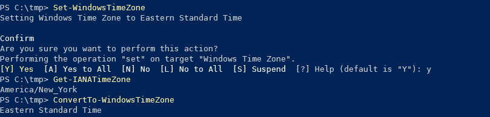

# WinTZ

[](https://github.com/PowerShell/PowerShell)
[](https://github.com/TsekNet/WinTZ/blob/master/LICENSE)
[](https://github.com/TsekNet/WinTZ/actions?query=workflow%3AWindows-Build)

WinTZ is a PowerShell module that sets the Windows Time Zone based on public IP address.

## Installation

Install WinTZ from the PowerShell Gallery by running the command below:

```powershell
Install-Module -Name WinTZ -Repository PSGallery -Scope CurrentUser
```

## Usage

Set the Windows time zone based on public IP address, without prompting for
confirmation

```powershell
Set-WindowsTimeZone -Force
```

Returns the IANA Time Zone based on public IP address.

```powershell
Get-IANATimeZone
```

Takes an IANA time zone and converts it to a Windows time zone.

```powershell
ConvertTo-WindowsTimeZone
```

WinTZ leverages [platyPS](https://github.com/PowerShell/platyPS) to
automatically generate Markdown documentation. See [docs](/docs/WinTZ.md) for
more information on individual functions.

## Screenshots



## Contributing

Pull requests are welcome. For major changes, please open an issue first to discuss what you would like to change.

Please make sure to update tests as appropriate.